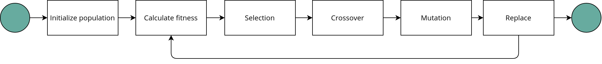
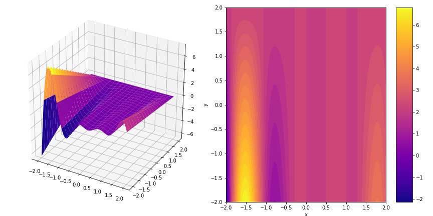
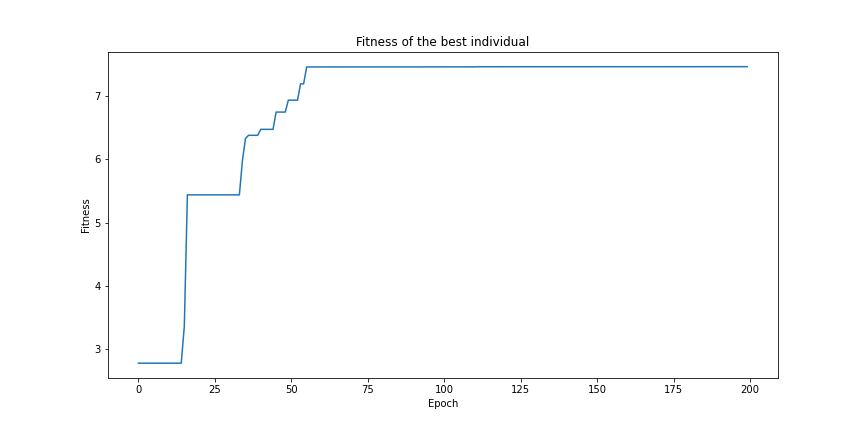
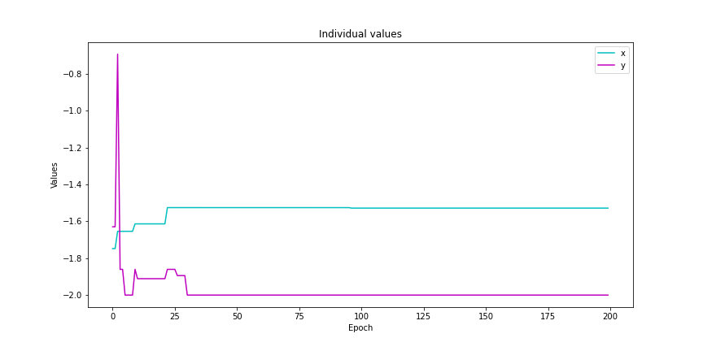

# Genetic Algorithm Class 
Python implementation of a genetic algorithm to solve optimization problems with `n` control variables.

## Description 
A [genetic algorithm](https://en.wikipedia.org/wiki/Genetic_algorithm) (GA) is a search heuristic part of a broader family of algorithms called [evolutionary algorithms](https://en.wikipedia.org/wiki/Evolutionary_algorithm) (EAs). EAs are population-based metaheuristics that integrate mechanisms inspired by biological evolution such as reproduction, mutation, selection. The GA algorithm  is used particularly in optimization problems where calculating gradients of an objective function is problematic or not possible. 

### Steps in GA

1. **Initialization**: initialize a population of *individuals* or candidate solutions to the problem. This initialization can be done by means of random sampling. Each individual is defined by an encoding which we call *genes*. 
2. **Selection**: calculate the best candidates based on a defined *fitness* function we want to optimize. We select the best `j` *parents* which will be combined. The parameter `j` is arbitrary. 
3. **Crossover**: we combine the genes of the parents to produce an *offspring*. These are `s` new individuals in our population.  
4. **Mutation**: add *randomness* to the generated offspring. We can add e.g. a Gausian noise to one of the genes of the offspring for each individual.
5. **Replacement**: select the `l` fittest individuals of the population to evaluate on the next epoch.

We repeat these evolution steps for certain amount of epochs or until an exit condition is met.



## GA implementation 

### Dependencies 

- [Numpy](https://numpy.org/) >= 1.18

### Hyperparameters 

- Individuals: 
    - `lower_bound`
    - `upper_bound`
    - `number_of_genes`: dimension of the search space. In this implementation it indicates the shape of the array that represents each individual.
    
    | Note: The number of genes of each individual and the fitness function must be congruent |
    | --- |

- Population:
    - `n_parents`: `j` parents.   
    - `offspring_size`: the `s` new individuals from combining `j`parents. 
    - `mutation_mean`, `mutation_sd`: mean and standard deviation of the Gaussian noise added during the mutation step.
    - `size`: maximum size of the population or `l` fittest individuals to survive for the next epoch. 

- Evolution: 
    - `epochs`: number of times we repet each evolution step. 

### Example 

An example fitness function could be something like this:

```python 
def fitness(x, y):
    return x*(x-1)*np.cos(2*x-1)*np.sin(2*x-1)*(y-2)
```


We can limit our search to evaluate individuals ) within the domain  with the `ind_parameters` dictionary. Likewise, we control the population parameters with the `pop_parameters`.

```python 
# example.py
import numpy as np
from ga.evolution import Evolution

# Define a fitness function
def fitness(x, y):
    return x * (x - 1) * np.cos(2 * x - 1) * np.sin(2 * x - 1) * (y - 2)

# Define parameter for each individual
ind_parameters = {'lower_bound': -2,
                  'upper_bound': 2,
                  'number_of_genes': 2}

# Define parameter for the entire population
pop_parameters = {'n_parents': 6,
                  'offspring_size':(2, ind_parameters['number_of_genes']),
                  'mutation_mean': 0.25,
                  'mutation_sd': 0.5,
                  'size': 10}
def example():
    # Instantiate an evolution
    evo = Evolution(pop_parameters, ind_parameters, fitness)
    # Repeat evolution step 200 epochs
    epochs = 10000
    # Record fitness history 
    history = []
    x_history = []
    y_history = []
    for _ in range(epochs):
        print('Epoch {}/{}, Progress: {}%\r'.format(_+1, epochs, np.round(((_+1)/epochs)*100, 2)), end="")
        evo.step()
        history.append(evo._best_score)
        x_history.append(evo._best_individual[0][0])
        y_history.append(evo._best_individual[0][1])
    
    print('\nResults:')
    print('Best individual:', evo.solution.best_individual)
    print('Fitness value of best individual:', evo.solution.best_score)

example()
```

The results are really close to the global optimum within this domain and the best individual does not change after 50 epochs.

```
# Output
Epoch  200/200, Progress 100.0%
Results:
Best individual: [-1.52637873, -2.        ]
Fitness value of best individual: 7.4697265870418414
``` 




## References

- [An Extensible Evolutionary Algorithm Example in Python](https://towardsdatascience.com/an-extensible-evolutionary-algorithm-example-in-python-7372c56a557b)
- [Genetic Algorithm Implementation in Python](https://towardsdatascience.com/genetic-algorithm-implementation-in-python-5ab67bb124a6)
